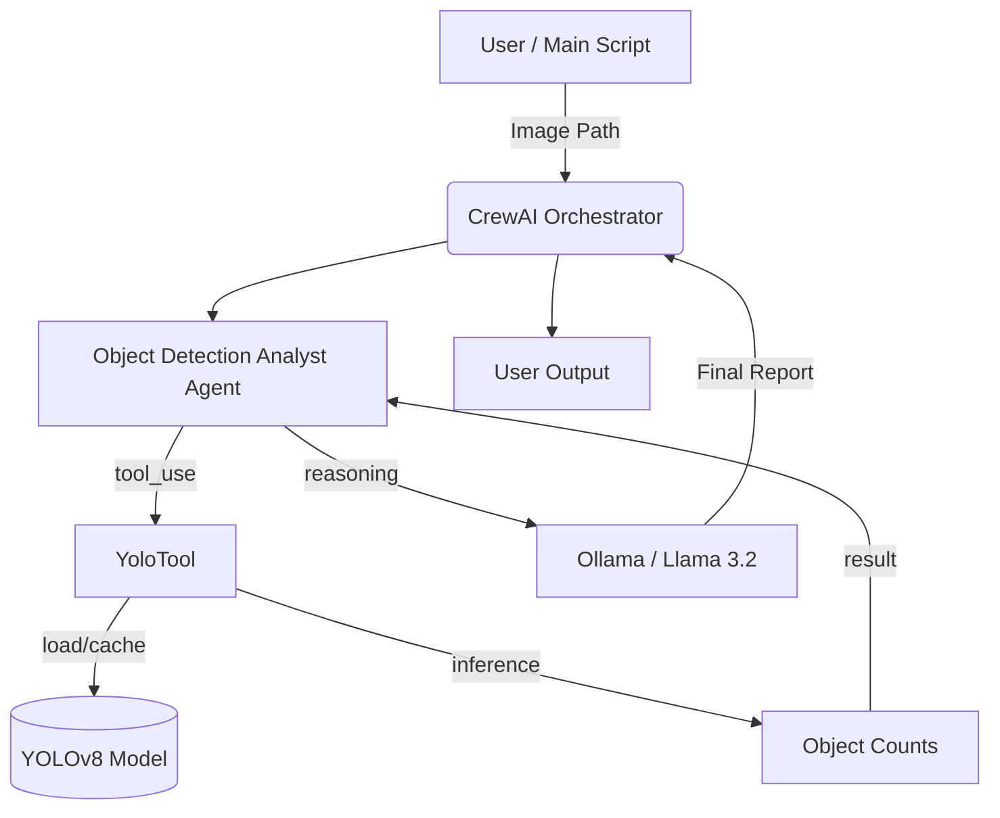
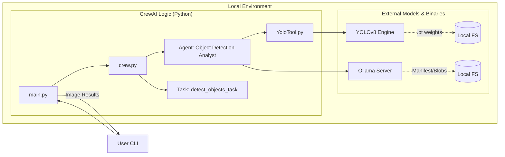
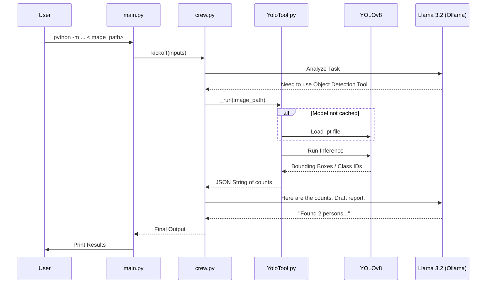

# Technical Documentation: CrewAI Vision Tool

This document provides a technical deep-dive into the architecture, dependencies, and execution flow of the `crewai_visiontool` project.

## 1. System Architecture

The project is built on the **CrewAI** framework, orchestrating a specialized agent that bridges computer vision (YOLO) with natural language reasoning (Local LLM).



## 1. Detailed Component Architecture

This diagram shows the relationship between the project's internal logic and external service providers.



## 2. Agentic AI Patterns Used

This project implements several key **Agentic AI** design patterns to create a robust and autonomous system:

### 2.1 ReAct (Reason + Act)
The core loop of our agent follows the **ReAct** pattern. Instead of just generating text, the agent:
1.  **Reasons** about the user request ("I need to see what's in this image").
2.  **Acts** by calling the `YoloTool`.
3.  **Observes** the output from the tool ("Found 2 persons").
4.  **Reasons** again to synthesize the final answer.

### 2.2 Role-Based Persona
By defining a specialized **Role** (Object Detection Analyst) and **Backstory** in `agents.yaml`, we use the **Persona Pattern**. This constrains the LLM's vast knowledge-base to a specific domain, reducing hallucinations and improving the professional tone of the reports.

### 2.3 Tool-Augmented Generation (TAG)
While similar to RAG (Retrieval Augmented Generation), this project uses **TAG**. The agent is augmented with a dynamic capability (computer vision) that it doesn't possess natively. It treats the YOLO model as an external "sense" to gather real-world data.

### 2.4 Guardrail & Termination Patterns
Small local models can sometimes "loop" or get stuck in a logic trap. We implement **Control Patterns**:
- **`max_iter`**: A hard stop to ensure the agent doesn't consume infinite resources.
- **Explicit Termination**: Prompt engineering that instructs the agent to "stop after getting tool results," which is a form of state-machine control for agentic workflows.

## 3. Core Tech Stack

### AI Frameworks
- **[crewAI](https://crewai.com)**: Orchestrates the agentic workflow and task management.
- **[Ultralytics YOLOv11](https://docs.ultralytics.com/)**: Provides the real-time object detection engine.
- **[Ollama](https://ollama.com/)**: Hosts the local `llama3.2` model for private, offline reasoning.
- **[LiteLLM](https://docs.litellm.ai/)**: Managed as an internal proxy for LLM communication.

### Libraries & Dependencies
| Library | Purpose |
| :--- | :--- |
| `crewai[tools]` | Core agent framework and tool base classes. |
| `ultralytics` | YOLOv8/v11 model loading and inference logic. |
| `opencv-python-headless` | Lightweight image processing utilities. |
| `fastapi` & `fastapi-sso` | Web/Logging infrastructure required by LiteLLM. |
| `apscheduler` | Internal task scheduling used by LiteLLM telemetry. |
| `python-dotenv` | Management of environment-specific configurations. |

## 3. Execution Flow

The system follows a sequential execution pattern:

1. **Initialization**: The `main.py` entry point accepts an image path and triggers the `CrewaiVisiontool` kickoff.
2. **Agent Engagement**: The `Object Detection Analyst` is activated. It is configured with a local LLM endpoint (`http://localhost:11434`).
3. **Tool Execution**:
    - The agent determines it needs visual data and calls the `YoloTool`.
    - **Caching**: The tool checks if the model is already loaded in memory to ensure sub-millisecond start times for subsequent calls.
    - **Inference**: YOLOv8 processes the image and identifies bounding boxes and class IDs.
    - **Formatting**: Raw detection data is condensed into a readable count (e.g., `{"person": 2, "dog": 1}`).
4. **Reasoning & Synthesis**: 
    - The agent receives the counts.
    - It uses the local Llama model to format these counts into a professional, context-aware report based on its "backstory" defined in `agents.yaml`.
5. **Safety Loop**: The `max_iter=3` safety valve ensures that if the local model gets confused, it is forced to provide a final answer rather than looping.

## 4. Sequence Diagram: Data Flow

This diagram illustrates the step-by-step sequence of events when a task is executed.



## 5. Code Deep Dive

### 5.1. Important Imports

Understanding the core building blocks:

| Import | Source | Purpose |
| :--- | :--- | :--- |
| `from crewai import Agent, Crew, Process, Task` | `crewai` | Primary orchestration classes for defining AI entities and workflows. |
| `from crewai.project import CrewBase, agent, crew, task` | `crewai` | Decorators and base class that enable the **YAML-to-Code** linking system. |
| `from crewai_tools import BaseTool` | `crewai_tools` | The standard interface for creating custom tools that Agents can understand. |
| `from ultralytics import YOLO` | `ultralytics` | The engine for loading and running the YOLO vision models. |
| `from crewai import LLM` | `crewai` | Provides a unified interface to connect to any LLM provider (Ollama in our case). |

### 5.2. Decorators & Logic

The project uses CrewAI's modern **Decorated Style**:

- **`@CrewBase`**: Marks the class as a factory for creating agents and tasks. It handles the automatic loading of `config/agents.yaml` and `config/tasks.yaml`.
- **`@agent`**: Dynamically creates an `Agent` instance using the YAML configuration. It allows injecting tools like `YoloTool()` directly into the agent.
- **`@task`**: Links a task description from YAML to a specific agent.
- **`@crew`**: Assembles all defined agents and tasks into a `Crew` instance with a specific `Process` (defaulting to `sequential`).

### 5.3. YoloTool Implementation

The `YoloTool` is the bridge between the AI's "brain" and its "eyes":

1.  **Environment Sync**: It uses `load_dotenv()` inside `_run` to ensure it can access `YOLO_MODEL` from the `.env` file even if called in different contexts.
2.  **Data Reduction**: Raw YOLO output is a complex object containing coordinates, confidences, and masks. The tool simplifies this into a **String-based Summary** because LLMs process text much better than raw coordinate arrays.
3.  **Counter Logic**: Uses Python's `collections.Counter` to quickly aggregate detections, ensuring the LLM gets a clear "What and How Many" summary.

## 6. Directory Structure
```text
crewai_visiontool/
├── src/
│   └── crewai_visiontool/
│       ├── config/          # Agent/Task behavior (YAML)
│       ├── tools/           # Custom YOLO logic
│       ├── crew.py          # Orchestration glue
│       └── main.py          # Entry point
├── .env                     # Configuration
└── pyproject.toml           # Strict dependency pinning
```

## 7. Configuration Strategy

The project uses a **Local-First** strategy:
- **Privacy**: No image data leaves your local network.
- **Zero Cost**: Uses free, open-source models (`yolov8n`, `llama3.2`).
- **Control**: All timeouts, iteration limits, and temperatures are configured in `crew.py`.
