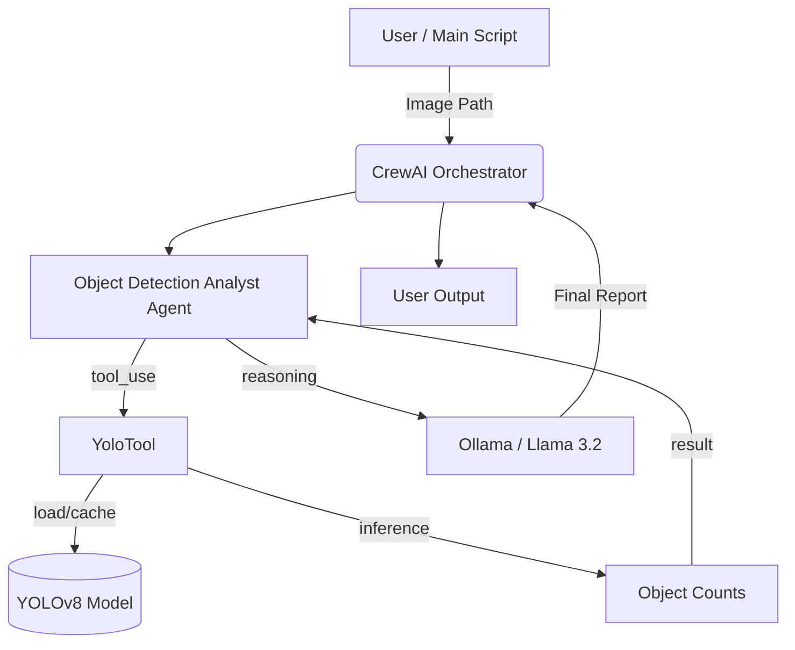

# Technical Documentation: CrewAI Vision Tool

This document provides a technical deep-dive into the architecture, dependencies, and execution flow of the `crewai_visiontool` project.

## 1. System Architecture

The project is built on the **CrewAI** framework, orchestrating a specialized agent that bridges computer vision (YOLO) with natural language reasoning (Local LLM).



## 2. Core Tech Stack

### AI Frameworks
- **[crewAI](https://crewai.com)**: Orchestrates the agentic workflow and task management.
- **[Ultralytics YOLOv11](https://docs.ultralytics.com/)**: Provides the real-time object detection engine.
- **[Ollama](https://ollama.com/)**: Hosts the local `llama3.2` model for private, offline reasoning.
- **[LiteLLM](https://docs.litellm.ai/)**: Managed as an internal proxy for LLM communication.

### Libraries & Dependencies
| Library | Purpose |
| :--- | :--- |
| `crewai[tools]` | Core agent framework and tool base classes. |
| `ultralytics` | YOLOv8/v11 model loading and inference logic. |
| `opencv-python-headless` | Lightweight image processing utilities. |
| `fastapi` & `fastapi-sso` | Web/Logging infrastructure required by LiteLLM. |
| `apscheduler` | Internal task scheduling used by LiteLLM telemetry. |
| `python-dotenv` | Management of environment-specific configurations. |

## 3. Execution Flow

The system follows a sequential execution pattern:

1. **Initialization**: The `main.py` entry point accepts an image path and triggers the `CrewaiVisiontool` kickoff.
2. **Agent Engagement**: The `Object Detection Analyst` is activated. It is configured with a local LLM endpoint (`http://localhost:11434`).
3. **Tool Execution**:
    - The agent determines it needs visual data and calls the `YoloTool`.
    - **Caching**: The tool checks if the model is already loaded in memory to ensure sub-millisecond start times for subsequent calls.
    - **Inference**: YOLOv8 processes the image and identifies bounding boxes and class IDs.
    - **Formatting**: Raw detection data is condensed into a readable count (e.g., `{"person": 2, "dog": 1}`).
4. **Reasoning & Synthesis**: 
    - The agent receives the counts.
    - It uses the local Llama model to format these counts into a professional, context-aware report based on its "backstory" defined in `agents.yaml`.
5. **Safety Loop**: The `max_iter=3` safety valve ensures that if the local model gets confused, it is forced to provide a final answer rather than looping.

## 4. Key Implementation Details

### Model Caching in `YoloTool`
To avoid the ~1-2 second overhead of loading the YOLO `.pt` file for every task, we implemented a class-level cache:
```python
class YoloTool(BaseTool):
    _model = None  # Class-level cache
    
    def _run(self, image_path: str) -> str:
        if YoloTool._model is None:
            YoloTool._model = YOLO(os.getenv("YOLO_MODEL", "yolov8n.pt"))
        # ... inference logic ...
```

### Environment Configuration
The system is highly configurable via `.env`:
- `YOLO_MODEL`: Allows switching between `yolov8n.pt` (faster) or `yolov8x.pt` (more accurate).
- `LITELLM_LOG=OFF`: Crucial for disabling verbose node.js-style logs in the Python console.

## 5. Directory Structure
```text
crewai_visiontool/
├── src/
│   └── crewai_visiontool/
│       ├── config/          # Agent/Task behavior (YAML)
│       ├── tools/           # Custom YOLO logic
│       ├── crew.py          # Orchestration glue
│       └── main.py          # Entry point
├── .env                     # Configuration
└── pyproject.toml           # Strict dependency pinning
```
